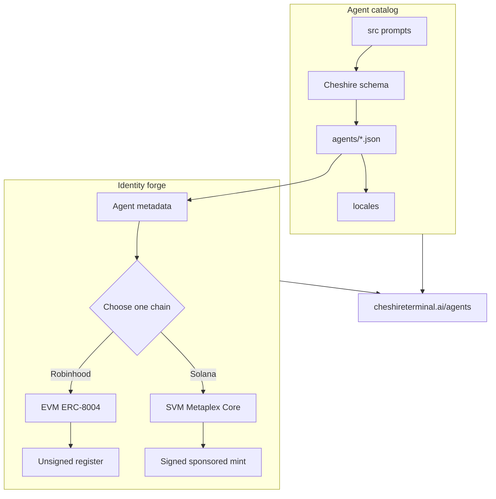

<p align="center">
  
</p>

# Cheshire Terminal Agents

<p align="center">
  <strong>Catalog + forge. One package for agent prompts and on-chain identity.</strong><br/>
  Ship Cheshire-schema agents, then register them on <em>either</em> Robinhood Chain (EVM / ERC-8004)
  or Solana (SVM / Metaplex Core) through the Cheshire Terminal hub.
</p>

<p align="center">
  <a href="https://cheshireterminal.ai/agents"></a>
  <a href="https://cheshireterminal.ai/agents/forge"></a>
  <a href="https://www.npmjs.com/package/cheshire-terminal-agents"></a>
  <a href="./LICENSE"></a>
</p>

<p align="center">
  
  
  
  
  
</p>

**Cheshire Terminal Agents** (`cheshire-terminal-agents` on npm) is the unified open-source package for:

1. **Agent catalog** — Cheshire-schema JSON agents (DeFi specialists + character personas), locales, and schema validation  
2. **Identity forge** — dual-chain registration (Robinhood Chain EVM + Solana SVM) with fail-closed safety  

Hosted surfaces: [agent hub](https://cheshireterminal.ai/agents) · [agent forge](https://cheshireterminal.ai/agents/forge) · [catalog API](https://cheshireterminal.ai/api/clawd/browser-agents)

> [!IMPORTANT]
> **Deployment and availability checked July 19, 2026:** identity, reputation, and validation registries are deployed on Robinhood Chain testnet (`46630`) and mainnet (`4663`). The [live Cheshire registry configuration](https://cheshireterminal.ai/api/robinhood/agents/config) exposes committed addresses, enforces `committed-manifest-only`, and reports runtime-code checks. The [Solana health endpoint](https://cheshireterminal.ai/api/metaplex-agents/health) reports `mainnet-beta` and discloses treasury, mint policy, authority model, holder gate, and finality. These are live-chain surfaces, not blanket consent: re-fetch trust responses, review the exact action, and obtain explicit wallet confirmation before any submission.

## What this package provides

| Surface | Included | Deliberate boundary |
|---|---|---|
| **Agent catalog** | 53 Cheshire-schema agents under `agents/`, 17-language locales, `schema/Cheshire_agent_schema.json`, import + validate scripts | Prompts + metadata only — not a trading bot runtime |
| **JavaScript SDK** | Metadata, unsigned EVM calldata, canonical deployment pins, runtime-code checks, Solana signing envelopes, hosted calls, catalog loaders | No private-key custody, automatic wallet signing, or bundled TypeScript declarations |
| **CLI** | Catalog list/show/validate; read-only forge discovery; local/hosted EVM prepare; explicit Solana mint | No silent EVM broadcast; no hidden live-write default |
| **Robinhood Chain** | Identity / Reputation / Validation contracts + `4663` / `46630` manifests | Identity is ERC-721; no fungible launcher |
| **Solana** | Owner-authorized, treasury-sponsored Metaplex Core mint + Agent Identity attempt | Hosted/policy-dependent; fungible Genesis launch paused |
| **Agent skill** | Portable forge `SKILL.md` + references | Instruction content — pin like code |
| **Quality gates** | Node tests (SDK, release, catalog), Foundry tests, pack checks | Tests are not a formal security audit |



## Install

```bash
npm install cheshire-terminal-agents
```

```js
import {
  // Catalog
  listCatalogIdentifiers,
  loadAgentWithLocale,
  validateCatalog,
  // Forge
  prepareCanonicalEvmRegistration,
  createAgentForge,
  PACKAGE_NAME,
  HUB_URL,
} from "cheshire-terminal-agents";

console.log(PACKAGE_NAME, HUB_URL);
console.log(listCatalogIdentifiers().length); // 53

const farmer = loadAgentWithLocale("defi-yield-farmer", "en");
console.log(farmer.meta.title, farmer.author);

const intent = prepareCanonicalEvmRegistration({
  chainId: 46630,
  name: farmer.meta.title,
  description: farmer.meta.description,
  image: "ipfs://bafy-example",
  services: [{ name: "MCP", endpoint: "https://example.com/mcp" }],
});
```

CLI binaries: `cheshire-terminal-agents`, `ct-agents`, and legacy alias `robinhood-agents`.

```bash
npx cheshire-terminal-agents agents-list
npx cheshire-terminal-agents agents-show --id defi-yield-farmer
npx cheshire-terminal-agents agents-validate
npx cheshire-terminal-agents capabilities --site https://cheshireterminal.ai
npx cheshire-terminal-agents deployments --chain 4663
npx cheshire-terminal-agents prepare-local-robinhood --file examples/robinhood-agent.json
```

Requires **Node.js `>=18.18`**, ESM-only.

## Agent catalog

| Source | Count | Notes |
|---|---:|---|
| DeFi / Solana specialists | 43 | Yield, security, governance, CLAWD / $CLAWD specialists |
| Character personas | 10 | Buffett, Graham, Cheshire, Clawd, Alice, … |
| **Total catalog IDs** | **53** | Under `agents/` |
| Locale trees | 43 | Under `locales/` (characters are EN-primary) |

Every catalog agent uses:

| Field | Value |
|---|---|
| `author` | `cheshire-terminal` |
| `homepage` | `https://cheshireterminal.ai/agents` |
| `config.systemRole` | Cheshire Terminal–framed specialty prompt |
| schema | `schema/Cheshire_agent_schema.json` |

### Catalog npm scripts

```bash
npm run import:agents      # rebuild catalog from monorepo agents/defi-agents + characters
npm run agents:import      # alias
npm run agents:validate    # schema + content checks
npm run agents:list        # print identifiers
npm run validate:agents    # alias for agents:validate
```

Import prefers monorepo paths when this package lives inside `solana-clawd`:

- `agents/characters/*.json`
- `agents/defi-agents/src/*.json`
- `agents/defi-agents/locales/**`
- `agents/defi-agents/schema/Cheshire_agent_schema.json`

### Catalog API (SDK)

| Export | Purpose |
|---|---|
| `listCatalogIdentifiers()` | Sorted agent IDs |
| `loadCatalog()` / `validateCatalog()` | Load + schema-shape validate all agents |
| `loadAgentWithLocale(id, locale?)` | Base agent + locale overlay |
| `applyLocaleOverlay` / `loadLocaleOverlay` | Merge i18n partials |
| `convertCharacterToCheshireAgent` | Character JSON → Cheshire agent |
| `normalizeDefiAgent` | Defi pack normalize |
| `loadCheshireSchema` / `SCHEMA_PATH` | Schema access |

## Choose a chain (identity forge)

| | Robinhood Chain | Solana |
|---|---|---|
| **Runtime** | EVM · testnet `46630` or mainnet `4663` | SVM · hosted route reports `mainnet-beta` |
| **Identity** | Transferable ERC-721 (ERC-8004 registration-v1) | Wallet-owned Metaplex Core + Agent Identity attempt |
| **Authorization** | Review `register(agentURI)` calldata, value `0` | Sign fresh `CLAWD_AGENT_MINT_V2`; sponsor submits mint |
| **Authority** | Owner controls NFT; `agentWallet` clears on transfer | User owns Core; treasury remains update authority; asset starts frozen |
| **Result** | Receipt + `ownerOf` / `agentURI` / `getAgentWallet` | Signature + asset reads; registration may need retry |
| **Hosted status** | Committed addresses; runtime checks pass | Sponsored Core mint configured; treat every submit as live mainnet write |

Choose **exactly one chain** per run. A second run on the other chain creates a second independent identity — nothing bridges or merges them.

Identity assets are **not** fungible agent tokens. Robinhood identity is ERC-721. Solana identity starts as Metaplex Core. Fungible Genesis launch remains production-paused.

### CLI forge commands

| Command | Effect | Write risk |
|---|---|---|
| `capabilities` | Framework boundaries + hosted rail status | Read-only |
| `deployments [--chain]` | Committed addresses + runtime pins | Read-only |
| `prepare-local-robinhood --file` | Local unsigned `register(agentURI)` | Local only |
| `prepare-robinhood --file` | Hosted unsigned EVM intent | No broadcast |
| `mint-solana --confirm-live-mint --file` | Sponsored Core mint | **Live Solana write** |
| `inspect --platform … --id …` | Read one identity | Read-only |

```bash
export CHESHIRE_API_KEY=ct_sk_your_key

# Hosted unsigned EVM intent — re-check destination and trust data.
npx cheshire-terminal-agents prepare-robinhood \
  --file examples/robinhood-agent.json \
  --site https://cheshireterminal.ai

# Explicit live Solana write — fresh CLAWD_AGENT_MINT_V2 only.
npx cheshire-terminal-agents mint-solana \
  --confirm-live-mint \
  --file examples/solana-agent.json \
  --site https://cheshireterminal.ai
```

> [!CAUTION]
> `mint-solana --confirm-live-mint` submits immediately. The CLI verifies the Ed25519 envelope and rejects placeholders; that is not user consent. Do not store seed phrases in JSON files.

## JavaScript forge SDK

### Pure local EVM preparation

```js
import { prepareCanonicalEvmRegistration } from "cheshire-terminal-agents";

const intent = prepareCanonicalEvmRegistration({
  chainId: 46630,
  name: "Open Research Agent",
  description: "Publishes verifiable research.",
  image: "ipfs://bafy-example",
  services: [{ name: "MCP", endpoint: "https://example.com/mcp" }],
  supportedTrust: ["reputation", "validation"],
});

console.log(intent.chainId, intent.to, intent.data, intent.value);
```

Accepts only `46630` or `4663`, encodes `register(agentURI)`, sets `value` to `0x0`. Fetch `eth_getCode` and pass it to `assertCanonicalRuntimeCode()` before signing.

### Hosted client

```js
import { createAgentForge } from "cheshire-terminal-agents";

const forge = createAgentForge({
  baseUrl: "https://cheshireterminal.ai",
  apiKey: process.env.CHESHIRE_API_KEY,
});

const status = await forge.capabilities();
const evmIntent = await forge.prepareRobinhood(registration);
const solanaResult = await forge.mintSolana(signedSolanaMint); // live write
```

### Solana wallet authorization

```js
import {
  assertSponsoredMintAuthorization,
  buildSponsoredMintAuthorization,
  createAgentForge,
} from "cheshire-terminal-agents";

const authorization = buildSponsoredMintAuthorization(source);
const signatureBytes = await wallet.signMessage(
  new TextEncoder().encode(authorization.message),
);
const signed = {
  ...source,
  walletMessage: authorization.message,
  walletSignature: Buffer.from(signatureBytes).toString("base64"),
};
assertSponsoredMintAuthorization(signed);
await createAgentForge({
  baseUrl: "https://cheshireterminal.ai",
  apiKey: process.env.CHESHIRE_API_KEY,
}).mintSolana(signed);
```

## Deployed ERC-8004 addresses

| Contract | Mainnet `4663` | Testnet `46630` |
|---|---|---|
| Identity | [`0x70361a37951d66F8C44Cfb45873DF2Ba8b9Fc950`](https://robinhoodchain.blockscout.com/address/0x70361a37951d66F8C44Cfb45873DF2Ba8b9Fc950) | [`0xf1A30080F5dA64Ab0456F3ADC06DfD8FC9d2fDB3`](https://explorer.testnet.chain.robinhood.com/address/0xf1A30080F5dA64Ab0456F3ADC06DfD8FC9d2fDB3) |
| Reputation | [`0x8a4154a6c1Ee44B4B790948f9613E3FB934628Ff`](https://robinhoodchain.blockscout.com/address/0x8a4154a6c1Ee44B4B790948f9613E3FB934628Ff) | [`0x2137528bf45480693fd22704A978F564A3Bb1570`](https://explorer.testnet.chain.robinhood.com/address/0x2137528bf45480693fd22704A978F564A3Bb1570) |
| Validation | [`0x020d053040Da31195e5F9A992B8edA663DBb073b`](https://robinhoodchain.blockscout.com/address/0x020d053040Da31195e5F9A992B8edA663DBb073b) | [`0x4126217abb0d12D8515698E819C543466f42eefd`](https://explorer.testnet.chain.robinhood.com/address/0x4126217abb0d12D8515698E819C543466f42eefd) |

Manifests pin runtime bytecode. Do **not** redeploy and create a competing identity namespace. Before each registration, verify:

```bash
curl -fsS https://cheshireterminal.ai/api/robinhood/agents/config \
  | jq '{addressPolicy, runtimeTrustRequired, networks: [.networks[] | {
      chainId, contracts, trusted: .runtimeVerification.trusted
    }]}'
```

## Project layout

```text
cheshire-terminal-agents/          # package root (repo folder: robinhood-agents/)
├── assets/cheshire-terminal-agents.svg
├── agents/                        # 53 Cheshire catalog agents
├── locales/                       # i18n overlays
├── schema/Cheshire_agent_schema.json
├── contracts/                     # ERC-8004 registry suite
├── deployments/                   # 4663 + 46630 pins
├── deploy/                        # Foundry deploy + safety
├── examples/                      # robinhood + solana templates
├── skills/robinhood-agent-forge/  # portable agent skill
├── scripts/import-agents.mjs
├── src/
│   ├── index.js                   # SDK + catalog exports
│   ├── agentCatalog.js
│   ├── deployments.js
│   └── cli.js
├── test/
├── package.json                   # name: cheshire-terminal-agents
└── README.md
```

## Security model

- Never request, store, print, or transmit private keys or seed phrases.
- Hosted Robinhood API prepares unsigned calldata and never broadcasts for the user.
- Re-fetch registry config before EVM writes; require zero value; verify bytecode.
- Sponsored Solana mint still needs a fresh owner wallet message + signature.
- Catalog prompts are instruction content — not custody or auto-execution.
- Agent identity assets are not promises of investment value.

## Development & tests

```bash
npm test                 # SDK + release + catalog tests
npm run check            # syntax + full Node suite
npm run import:agents    # rebuild catalog from monorepo sources
npm run agents:validate
npm run setup:solidity
npm run test:solidity
npm run pack:check
```

| Suite | Focus |
|---|---|
| `test/sdk.test.js` | EVM calldata, deployment pins, Solana auth, hosted client |
| `test/release.test.js` | MIT, exports, deploy gates, offline CLI |
| `test/agents-catalog.test.js` | Schema, identifiers, locales, content preservation |
| `deploy/test/*` | Deployment safety + Solidity registry tests |

## Version note

| Version | Role |
|---|---|
| `1.43.0` | First catalog-only npm publish |
| **`1.44.0`** | **Unified Cheshire Terminal Agents** — catalog + dual-chain forge (this package) |

Legacy package name `@cheshire-terminal/robinhood-agents` and CLI alias `robinhood-agents` remain documented for migrations. Prefer `cheshire-terminal-agents` / `ct-agents`.

## License

[MIT](LICENSE) © Cheshire Terminal contributors.
