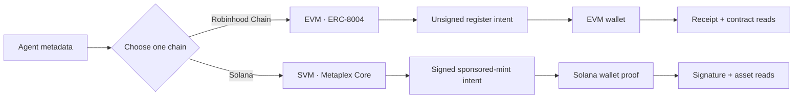

<p align="center">
  
</p>

# Robinhood Agents — EVM + SVM Agent Forge

<p align="center">
  <strong>Choose where your agent identity lives.</strong><br/>
  Prepare an ERC-8004-compatible identity on Robinhood Chain, or mint a Metaplex Core asset and attempt Agent Identity registration on Solana.
</p>

<p align="center">
  <a href="https://cheshireterminal.ai/agents/forge"></a>
  
  <a href="./LICENSE"></a>
</p>

<p align="center">
  
  
  
  
</p>

This repository is dual-chain despite its name. It packages a dependency-light JavaScript SDK and CLI, three open-source Solidity registries, request templates, a reusable `SKILL.md`, and safety tests. The hosted experience is [Cheshire Terminal Agent Forge](https://cheshireterminal.ai/agents/forge).

> [!IMPORTANT]
> **Deployment and availability checked July 19, 2026:** the identity, reputation, and validation registries are deployed on Robinhood Chain testnet (`46630`) and mainnet (`4663`). Identity and validation source are explorer-verified; reputation source verification remains pending. Deployment is not product enablement: the [live Cheshire registry configuration](https://cheshireterminal.ai/api/robinhood/agents/config) still returns `null` for all six contract slots, so hosted EVM preparation and registration fail closed. The [Solana health endpoint](https://cheshireterminal.ai/api/metaplex-agents/health) reports a configured `mainnet-beta` sponsored-mint backend.

## Choose a chain

| | Robinhood Chain | Solana |
|---|---|---|
| **Runtime** | EVM · testnet `46630` or mainnet `4663` | SVM · hosted route currently reports `mainnet-beta` |
| **Identity** | Transferable ERC-721 identity using the repository's ERC-8004 `registration-v1` compatibility surface | Wallet-owned Metaplex Core asset plus an attempted Agent Identity registration |
| **Authorization** | Review `register(agentURI)` calldata and zero value, then submit from an EVM wallet | Sign a fresh `CLAWD_AGENT_MINT_V2` message; the authenticated sponsor submits the mint |
| **Authority** | Owner controls the NFT; `agentWallet` initially equals the owner and is cleared by transfer | User owns the Core asset; sponsoring treasury remains update authority; the permanent freeze delegate has no authority and the asset starts frozen |
| **Result** | Receipt plus direct `ownerOf`, `agentURI`, and `getAgentWallet` reads | Confirmed signature plus asset and Agent Identity reads; registration may require a retry after a successful mint |
| **Current hosted status** | Contracts deployed; public addresses not configured, so registration is disabled | Sponsored Core mint configured; holder/session policy applies |

Choose exactly one chain for each run. You can repeat the flow on the other chain later, but that creates a second, independent identity. Nothing here silently bridges assets, merges ownership, or creates one token on both chains.



## Identity assets are not fungible agent tokens

- The Robinhood identity is an ERC-721 registry record, not a fungible launch token.
- The Solana identity starts as a Metaplex Core asset, not a fungible launch token.
- The owner-signed Solana Genesis token builder is implemented elsewhere in Cheshire Terminal but intentionally **paused in production** pending durable intents and launch-link reconciliation.
- Robinhood's fungible `CheshireBondingLaunchpad` is a separate deployed contract surface. It is not part of ERC-8004 and must never be configured as an identity registry.

## Quick start from source

```bash
git clone https://github.com/Solizardking/robinhood-agents.git
cd robinhood-agents
npm install
npm run check

# Read-only discovery of both hosted rails.
node src/cli.js capabilities --site https://cheshireterminal.ai

# Read the committed address and runtime-code pins without a network request.
node src/cli.js deployments --chain 4663

# Prepare canonical testnet register(agentURI) calldata entirely locally.
node src/cli.js prepare-local-robinhood --file examples/robinhood-agent.json
```

The package requires Node.js 18 or newer. It is ESM-only and currently exposes named JavaScript exports without bundled TypeScript declarations. The npm name is `@cheshire-terminal/robinhood-agents`, but it is not publicly available from npm as of the status date above; cloning or pinning the source is the supported setup shown here.

### CLI commands

| Command | Effect | Write risk |
|---|---|---|
| `capabilities` | Shows static framework boundaries, Robinhood registry config, and Solana health | Read-only |
| `deployments [--chain CHAIN_ID]` | Reads committed addresses, receipts, and runtime-code pins | Read-only |
| `prepare-local-robinhood --file FILE` | Encodes unsigned calldata against the committed canonical identity registry | Local only; no RPC or broadcast |
| `prepare-robinhood --file FILE` | Requests reviewable unsigned EVM calldata from Cheshire | No broadcast; currently fails closed until public registry config is enabled |
| `mint-solana --confirm-live-mint --file FILE` | Sends a signed wallet intent to the sponsored mint route | **Live Solana write** |
| `inspect --platform robinhood --id ID --chain CHAIN_ID` | Reads one configured EVM identity | Read-only |
| `inspect --platform solana --id ASSET_ADDRESS` | Reads one Solana agent asset | Read-only |

```bash
# Hosted unsigned EVM intent. This will fail safely while public config is null.
node src/cli.js prepare-robinhood \
  --file examples/robinhood-agent.json \
  --site https://cheshireterminal.ai

# Read-only inspection.
node src/cli.js inspect --platform robinhood --id 1 --chain 4663
node src/cli.js inspect --platform solana --id SOLANA_ASSET_ADDRESS

# Explicit live Solana write. Replace every placeholder with a newly signed
# CLAWD_AGENT_MINT_V2 authorization; never store a seed phrase in the JSON file.
export CHESHIRE_API_KEY=ct_sk_your_key
node src/cli.js mint-solana \
  --confirm-live-mint \
  --file examples/solana-agent.json \
  --site https://cheshireterminal.ai
```

`CHESHIRE_SITE_URL` can replace repeated `--site` flags. `CHESHIRE_API_KEY` is sent as a bearer token when present. A valid holder/admin session or API authorization is required by the hosted Solana write route.

> [!CAUTION]
> `mint-solana --confirm-live-mint` submits immediately to the selected site; there is no second wallet prompt in the CLI. The CLI cryptographically verifies the canonical Ed25519 envelope and rejects the checked-in placeholders, but that is not user consent. Do not run the command until the file contains a newly constructed, freshly signed authorization intended for the health-reported cluster. Do not store or reuse signed intent files.

The CLI consumes an already signed Solana authorization and never invokes a wallet adapter. The SDK's `buildSponsoredMintAuthorization()` returns the exact normalized bytes to present to a wallet, but never signs them. Use the [hosted Solana wallet flow](https://cheshireterminal.ai/agents/mint) or integrate those bytes with a trusted wallet. Never invent or hand-edit the signed message.

## JavaScript SDK

### Pure local EVM preparation

`prepareCanonicalEvmRegistration()` validates metadata and encodes calldata locally against the identity address in the reviewed manifest. It does not contact Cheshire, open a wallet, or broadcast a transaction.

```js
import { prepareCanonicalEvmRegistration } from "./src/index.js";

const intent = prepareCanonicalEvmRegistration({
  chainId: 46630,
  name: "Open Research Agent",
  description: "Publishes verifiable research.",
  image: "ipfs://bafy-example",
  services: [{ name: "MCP", endpoint: "https://example.com/mcp" }],
  supportedTrust: ["reputation", "validation"],
});

console.log(intent.chainId, intent.to, intent.data, intent.value);
// Review and decode these exact fields before passing them to an EVM wallet.
```

The helper accepts only chain `46630` or `4663`, encodes `register(agentURI)`, sets `value` to `0x0`, and returns the expected runtime hash and byte count. Fetch `eth_getCode` immediately before signing and pass it to `assertCanonicalRuntimeCode()`; a manifest alone cannot prove the current RPC response. `prepareEvmRegistration()` remains available for an explicitly supplied custom registry and labels whether that address matches the canonical pin. If no `agentURI` is supplied, both helpers create a Node `Buffer`-backed base64 JSON data URI. Prefer immutable `ipfs://` metadata for production identities.

### Hosted client

```js
import { createAgentForge } from "./src/index.js";

const forge = createAgentForge({
  baseUrl: "https://cheshireterminal.ai",
  apiKey: process.env.CHESHIRE_API_KEY,
});

const status = await forge.capabilities(); // read-only

// Unsigned EVM intent; available after the hosted registry config is enabled.
const evmIntent = await forge.prepareRobinhood(robinhoodRegistration);

// Explicit live Solana write. The input must include a fresh wallet message
// and the owner's canonical base64 Ed25519 signature. The SDK verifies both.
const solanaResult = await forge.mintSolana(signedSolanaMint);

const evmAgent = await forge.inspect({ platform: "robinhood", id: 1, chainId: 4663 });
const svmAgent = await forge.inspect({ platform: "solana", id: "ASSET_ADDRESS" });
```

When this source is installed as a pinned local/workspace dependency—or after a verified package release exists—replace `./src/index.js` with `@cheshire-terminal/robinhood-agents`.

### Exports

| Export | Purpose |
|---|---|
| `platforms` | Informational EVM/SVM network identifiers; operations still follow explicit input and hosted configuration |
| `frameworkCapabilities` | Explicit identity and fungible-token availability boundaries |
| `canonicalDeployments` / `getCanonicalContract()` | Reviewed address, receipt, binding, and runtime-code pins for `4663` and `46630` |
| `inspectCanonicalRuntimeCode()` / `assertCanonicalRuntimeCode()` | Compare RPC `eth_getCode` output with a pinned hash and byte count |
| `identityRegistryAbi` | Minimal ABI for `register(string agentURI)` |
| `buildRegistration(input)` | Validates and normalizes ERC-8004 registration metadata |
| `registrationDataUri(document)` | Encodes a registration document as a base64 data URI |
| `prepareEvmRegistration(input)` | Pure unsigned EVM intent builder with an explicit trusted registry |
| `prepareCanonicalEvmRegistration(input)` | Pure unsigned EVM intent builder using a committed canonical registry pin |
| `buildSponsoredMintAuthorization(input)` | Normalizes a Solana Core mint intent and returns exact wallet-signing bytes; never signs |
| `assertSponsoredMintAuthorization(input)` | Checks freshness, normalized digest, canonical base64, and Ed25519 ownership before POST |
| `serializeSponsoredMintRequest(input)` | Maps SDK `registrationUri` to server-recognized `customRegistrationUri` without changing signed bytes |
| `createCheshireClient(options)` | Low-level hosted API client |
| `createAgentForge(options)` | Chain-selectable local preparation, hosted preparation, explicitly live Core mint, and inspection facade |

The public client deliberately does not expose operator-only Solana server-signer mutations or a fungible token-launch method. Hosted methods return parsed server JSON without TypeScript declarations, general response-schema validation, retries, or a built-in timeout; callers must validate fields they rely on and supply their own request boundary where needed.

## Hosted API map

| Method and route | Purpose | Access |
|---|---|---|
| `GET /api/robinhood/agents/config` | Trusted EVM networks and registry addresses | Public read |
| `POST /api/robinhood/agents/prepare-registration` | Build unsigned `register(agentURI)` calldata | Stateless preparation; fails closed without trusted config |
| `GET /api/robinhood/agents/:agentId?chainId=...` | Direct configured-registry identity read | Public read |
| `GET /api/robinhood/agents` | Mainnet agent discovery | Public read |
| `GET /api/metaplex-agents/health` | Solana cluster and backend capability status | Public read |
| `POST /api/metaplex-agents/mint` | Wallet-authorized, treasury-sponsored Core mint and Agent Identity attempt | Authenticated live write |
| `GET /api/metaplex-agents/fetch/:assetAddress` | Fetch confirmed Solana agent data | Public read |

`/api/metaplex-agents/register`, `/delegate`, and `/set-token` are operator-only server-signer routes. Do not expose them to normal users.

A Solana mint can confirm while Agent Identity registration fails. Treat HTTP `202` or `partial: true` as partial success, surface `registered` and `registrationError`, preserve both mint and registration signatures when returned, and never claim a complete Agent Identity until the registration read succeeds.

## ERC-8004-compatible registry suite

The canonical suite is deployed as three contracts per Robinhood chain. Reputation and validation permanently reference the identity registry supplied to their constructors. Clients must pin reviewed addresses because the contracts cannot prevent someone from deploying a competing suite.

| Contract | Core behavior |
|---|---|
| [`CheshireAgentIdentityRegistry`](contracts/CheshireAgentIdentityRegistry.sol) | Dependency-free ERC-721 identity, three registration overloads, URI and metadata updates, transfers/approvals, reserved `agentWallet`, and EIP-712/EIP-1271 wallet proof |
| [`CheshireAgentReputationRegistry`](contracts/CheshireAgentReputationRegistry.sol) | Decimal feedback, tags/evidence, revocation, responses, full reads, and explicit reviewer-filtered summaries |
| [`CheshireAgentValidationRegistry`](contracts/CheshireAgentValidationRegistry.sol) | Authorized validator requests, repeatable validator responses, evidence/status reads, summaries, and agent/validator discovery |

Compatibility targets the concrete ERC-8004 `registration-v1` interface implemented here. Review the code against the [current EIP-8004 specification](https://eips.ethereum.org/EIPS/eip-8004) before production use.

### Deployed addresses

| Contract | Robinhood mainnet `4663` | Robinhood testnet `46630` |
|---|---|---|
| Identity | [`0x70361a37951d66F8C44Cfb45873DF2Ba8b9Fc950`](https://robinhoodchain.blockscout.com/address/0x70361a37951d66F8C44Cfb45873DF2Ba8b9Fc950) · source verified | [`0xf1A30080F5dA64Ab0456F3ADC06DfD8FC9d2fDB3`](https://explorer.testnet.chain.robinhood.com/address/0xf1A30080F5dA64Ab0456F3ADC06DfD8FC9d2fDB3) · source verified |
| Reputation | [`0x8a4154a6c1Ee44B4B790948f9613E3FB934628Ff`](https://robinhoodchain.blockscout.com/address/0x8a4154a6c1Ee44B4B790948f9613E3FB934628Ff) · verification pending | [`0x2137528bf45480693fd22704A978F564A3Bb1570`](https://explorer.testnet.chain.robinhood.com/address/0x2137528bf45480693fd22704A978F564A3Bb1570) · verification pending |
| Validation | [`0x020d053040Da31195e5F9A992B8edA663DBb073b`](https://robinhoodchain.blockscout.com/address/0x020d053040Da31195e5F9A992B8edA663DBb073b) · source verified | [`0x4126217abb0d12D8515698E819C543466f42eefd`](https://explorer.testnet.chain.robinhood.com/address/0x4126217abb0d12D8515698E819C543466f42eefd) · source verified |

<details>
<summary><strong>Mainnet creation receipts</strong></summary>

All three transactions succeeded in block `14150372` on July 19, 2026 at `21:06:37 UTC`.

| Contract | Creation transaction |
|---|---|
| Identity | [`0xfbd83784276d5463bb0a1cd419dc7634b3aff85a5b66456b1dbb6a3951aa6db0`](https://robinhoodchain.blockscout.com/tx/0xfbd83784276d5463bb0a1cd419dc7634b3aff85a5b66456b1dbb6a3951aa6db0) |
| Reputation | [`0x7ac254c70427a5f744ddecec5fe90b265ba3d71d018ca227a36ba3a6aa813fa6`](https://robinhoodchain.blockscout.com/tx/0x7ac254c70427a5f744ddecec5fe90b265ba3d71d018ca227a36ba3a6aa813fa6) |
| Validation | [`0x04c7048be36330c91022161375729ce4488abf0815f558376b1ad5fcee1ca179`](https://robinhoodchain.blockscout.com/tx/0x04c7048be36330c91022161375729ce4488abf0815f558376b1ad5fcee1ca179) |

</details>

### Hosted activation checklist

The suite is already deployed. Do **not** rerun a deployer and create a competing identity namespace. The current application source accepts only the committed [mainnet](deployments/agent-registries-mainnet-4663.json) and [testnet](deployments/agent-registries-testnet-46630.json) manifests; runtime environment variables cannot redirect the wallet flow to another registry.

After promoting the current server/frontend release, verify the public trust response:

```bash
curl -fsS https://cheshireterminal.ai/api/robinhood/agents/config \
  | jq '{addressPolicy, runtimeTrustRequired, networks: [.networks[] | {
      chainId,
      contracts,
      trusted: .runtimeVerification.trusted,
      checks: [.runtimeVerification.contracts[] | {role, status}]
    }]}'
```

Require `addressPolicy: "committed-manifest-only"`, the exact pinned addresses, and six passing runtime-code checks. Then execute an end-to-end testnet wallet registration before exercising mainnet. Never expose alternative trusted addresses as mutable `VITE_*` browser configuration.

### Reproduce and deploy the registry infrastructure

This repository includes a standalone Foundry project, a Solidity test harness, and a fixed deployment entrypoint. Install the pinned test dependency and compile first:

```bash
npm run setup:solidity
npm run test:solidity

# A simulation still needs an RPC and a throwaway gas-only key because Forge
# derives the broadcaster, but it does not send a transaction.
EXPECTED_CHAIN_ID=46630 \
PRIVATE_KEY=0xYOUR_32_BYTE_THROWAWAY_KEY \
deploy/scripts/deploy-agent-registries.sh
```

The wrapper defaults to simulation, probes `eth_chainId` before Forge, rejects malformed or credential-leaking RPC URLs, and requires exact chain-specific confirmation for `--broadcast`. Mainnet additionally requires a quota-backed RPC attestation and a nonzero audit-artifact digest. The Solidity script repeats chain and confirmation checks in broadcast context.

Both supported chains already have canonical deployments, so the shipped manifests make `--broadcast` stop before reading `PRIVATE_KEY` or contacting an RPC. That prevents accidental duplicate namespaces. An intentional independent registry operator must fork the project, choose and document a distinct namespace, replace the canonical manifest/policy, audit the contracts, and retain all broadcast gates. A deployment receipt proves only that bytecode was created; it does not make the new namespace canonical or audited.

### Separate Robinhood mainnet contracts

These contracts are related to Cheshire's broader token-launch stack but are **not** part of this repository's ERC-8004 registry suite:

| Contract | Mainnet address | Purpose |
|---|---|---|
| `CheshireProvenanceRegistry` | [`0xBa6f151D8817090A108A6a52A0B8c502D9a5De19`](https://robinhoodchain.blockscout.com/address/0xba6f151d8817090a108a6a52a0b8c502d9a5de19) | Ticker and launch provenance |
| `CheshireBondingLaunchpad` | [`0x6344a4C108B8Fe03e9D79523AB0Ac588a45cd092`](https://robinhoodchain.blockscout.com/address/0x6344a4c108b8fe03e9d79523ab0ac588a45cd092) | First-party bonding-curve factory |
| First `CLAWD` bonding token | [`0xE1c14eE7DbACCE44315191c13f63963BfeAe5D0c`](https://robinhoodchain.blockscout.com/address/0xe1c14ee7dbacce44315191c13f63963bfeae5d0c) | First token created by the pinned launchpad |

Their Blockscout source verification is currently incomplete. Never use any of these three addresses as an identity, reputation, or validation registry.

## Install the reusable agent skill

The skill teaches an AI coding agent to ask for a chain choice, keep live writes explicit, inspect canonical state, and avoid private-key handling.

```bash
# Install into this project's agent-skill directory.
mkdir -p .agents/skills
cp -R skills/robinhood-agent-forge .agents/skills/
```

Install from a reviewed commit or release and keep the package and skill versions pinned together; a skill is executable instruction content, not merely documentation.

Then ask your agent:

```text
Use $robinhood-agent-forge to register my agent. Ask me to choose
Robinhood Chain or Solana before preparing any transaction.
```

Skill contents:

- [`SKILL.md`](skills/robinhood-agent-forge/SKILL.md) — lifecycle and guardrails.
- [`references/api.md`](skills/robinhood-agent-forge/references/api.md) — hosted routes and request behavior.
- [`references/deployment.md`](skills/robinhood-agent-forge/references/deployment.md) — network and deployment safety.
- [`references/sdk.md`](skills/robinhood-agent-forge/references/sdk.md) — exact SDK exports, install, and wallet-signing examples.
- [`agents/openai.yaml`](skills/robinhood-agent-forge/agents/openai.yaml) — UI metadata and default prompt.

## Project layout

```text
robinhood-agents/
├── .github/      Node and Foundry CI
├── assets/       animated README artwork
├── contracts/    identity, reputation, and validation Solidity sources
├── deploy/       guarded Foundry script, preflight, and Solidity tests
├── deployments/  canonical receipts, addresses, bindings, and runtime hashes
├── examples/     Robinhood metadata and signed-Solana input templates
├── skills/       portable robinhood-agent-forge skill package
├── src/          zero-build JavaScript SDK and CLI
├── test/         Node SDK and safety tests
├── LICENSE       MIT license
└── package.json  package exports, CLI binary, and scripts
```

## Security model

- Never request, store, print, or transmit a user's private key or seed phrase.
- The hosted Robinhood API prepares unsigned calldata and never broadcasts for the user.
- Re-fetch registry configuration before an EVM write; decode `register(agentURI)`, require zero value, verify bytecode, simulate, and check receipt events plus direct contract state.
- ERC-721 approvals are transfer-capable authority. Transferring an identity clears its verified `agentWallet`; the new owner must set one with fresh EIP-712 or ERC-1271 proof.
- A sponsored Solana mint still requires a fresh owner-wallet message and signature. Disclose ownership, treasury update authority, freeze delegate policy, cluster, and returned transaction signature.
- Reputation is transparent feedback, not automatically Sybil-resistant. Validation records what a named validator reports; it does not provide staking, slashing, or universal truth.
- A successful deployment receipt proves bytecode exists, not that the contracts are audited or that a hosted product is configured.
- Agent identity assets are not promises of investment value.

## Development and tests

```bash
npm test       # Node test runner: metadata, intent, fail-closed, and auth behavior
npm run check  # Syntax checks plus the full SDK test suite
npm run setup:solidity  # install pinned forge-std into ignored deploy/lib
npm run test:solidity   # compile and execute the registry contract suite
npm run pack:check      # inspect the npm release contents without publishing
```

The SDK intentionally has no build step. Node tests mock hosted requests and perform no live writes. CI runs Node 18, 20, and 22 plus `forge fmt --check` and the Solidity suite.

## License

[MIT](LICENSE) © Cheshire Terminal contributors.
